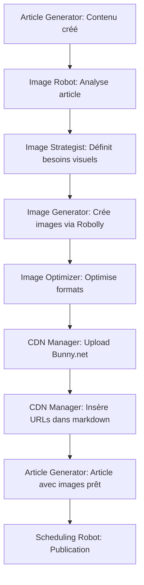
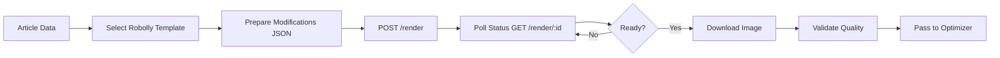
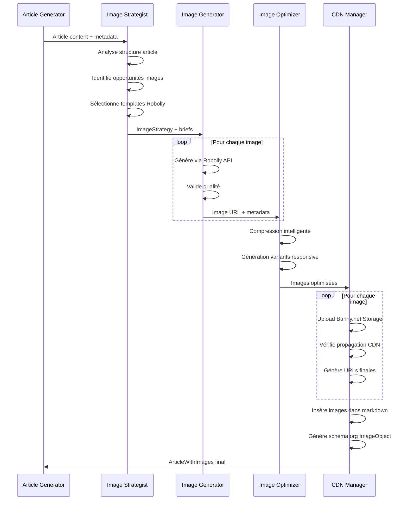

# 🎨 Robot Images - Génération et Gestion Automatisée

## 📋 Vision

Système d'automatisation intelligent pour la génération, optimisation et publication d'images visuelles pour les articles de blog. Le robot intègre des APIs de génération d'images (Robolly, Abyssale, IA) et gère le déploiement sur CDN Bunny.net.

---

## 🎯 Objectifs Stratégiques

### SEO et Engagement
- **Images optimisées SEO** : Alt text descriptifs, noms de fichiers avec mots-clés
- **Core Web Vitals** : Images optimisées (WebP/AVIF), responsive, lazy loading
- **Google Image Search** : Visibilité dans recherche images avec métadonnées structurées
- **Engagement utilisateur** : Réduction bounce rate, amélioration dwell time

### Qualité Visuelle
- **Cohérence branding** : Templates Robolly avec identité visuelle unifiée
- **Images contextuelles** : Visuels pertinents au contenu de l'article
- **Formats multiples** : Hero images, section breaks, social media cards (OG images)
- **Accessibilité** : Alt text descriptifs pour lecteurs d'écran

### Automatisation Complète
- **Zéro intervention manuelle** : Génération automatique lors de la création d'articles
- **CDN intégré** : Upload et distribution automatique via Bunny.net
- **Cache optimisé** : URLs CDN avec cache headers performants
- **Monitoring qualité** : Validation automatique des images générées

---

## 🏗️ Architecture High-Level

### Option Retenue : Standalone Image Robot (Multi-Agent CrewAI)

Architecture modulaire et réutilisable permettant l'utilisation cross-plateforme (articles, newsletter, social media).

#### Agents Spécialisés

**1. Image Strategist Agent**
- **Rôle** : Analyse contenu et définit stratégie visuelle
- **Fonctionnalités** :
  - Extraction titres, headings, topics clés de l'article
  - Détermination nombre et types d'images (hero, sections, OG card)
  - Sélection style guide et palette couleurs
  - Priorisation images selon importance contenu

**2. Image Generator Agent**
- **Rôle** : Génération images via APIs externes
- **Fonctionnalités** :
  - **Robolly API** : Templates avec overlays texte dynamiques (hero images, social cards)
  - **Abyssale API** (futur) : Variations design et A/B testing
  - **AI Image Gen** (futur) : DALL-E 3 / Midjourney pour illustrations custom
  - Retry logic en cas d'échec API
  - Validation qualité images générées

**3. Image Optimizer Agent**
- **Rôle** : Optimisation performance et formats
- **Fonctionnalités** :
  - Compression intelligente (balance qualité/poids)
  - Génération formats modernes (WebP, AVIF)
  - Création variantes responsive (1x, 2x, mobile/desktop)
  - Optimisation métadonnées EXIF

**4. CDN Manager Agent**
- **Rôle** : Déploiement et gestion CDN
- **Fonctionnalités** :
  - Upload Bunny.net Storage API
  - Configuration Pull Zone et cache headers
  - Génération URLs CDN optimisées
  - Vérification propagation CDN
  - Mise à jour markdown avec URLs finales

---

## 🔗 Intégration avec Article Generator

### Workflow Intégré



### Point d'Intégration

L'Article Generator appelle l'Image Robot après génération du contenu texte :

```python
# Dans Article Generator workflow
from agents.images.image_crew import ImageRobotCrew

# Génération article
generated_article = article_generator.generate(topic="AI in 2026")

# Appel Image Robot
image_robot = ImageRobotCrew()
article_with_images = image_robot.process(
    article_content=generated_article.content,
    article_title=generated_article.title,
    article_topics=generated_article.key_topics,
    image_strategy="hero+sections",  # ou "minimal", "rich"
    style_guide="brand_primary"      # cohérence visuelle
)

# Article final avec images intégrées
final_article = {
    "content": article_with_images.markdown,
    "images": article_with_images.image_metadata,
    "seo": article_with_images.seo_data
}
```

### Schémas Pydantic

```python
from pydantic import BaseModel, HttpUrl
from typing import List, Dict, Optional

class ImageStrategy(BaseModel):
    """Stratégie visuelle pour l'article"""
    article_title: str
    article_topics: List[str]
    num_images: int  # Nombre total d'images
    image_types: List[str]  # ["hero", "section_1", "section_2", "og_card"]
    style_guide: str  # "brand_primary", "brand_blue", etc.
    robolly_template_ids: List[str]  # IDs templates Robolly

class GeneratedImage(BaseModel):
    """Image générée validée"""
    image_type: str  # "hero", "section", "og_card"
    robolly_render_id: str  # ID génération Robolly
    original_url: HttpUrl  # URL temporaire Robolly
    cdn_url: Optional[HttpUrl] = None  # URL finale Bunny.net
    alt_text: str  # SEO alt text
    file_name: str  # nom-fichier-seo-optimise.webp
    dimensions: Dict[str, int]  # {"width": 1200, "height": 630}
    file_size_kb: int
    format: str  # "webp", "avif", "jpg"

class OptimizedImageSet(BaseModel):
    """Ensemble d'images optimisées pour responsive"""
    original: GeneratedImage
    variants: List[GeneratedImage]  # [mobile, tablet, desktop, 2x]
    srcset: str  # HTML srcset attribute
    sizes: str  # HTML sizes attribute

class ArticleWithImages(BaseModel):
    """Article enrichi avec images"""
    markdown: str  # Markdown avec images insérées
    images: List[OptimizedImageSet]
    image_metadata: Dict[str, any]  # Métadonnées pour schema.org
    seo_data: Dict[str, str]  # Alt text, captions, etc.
    cdn_stats: Dict[str, any]  # URLs, propagation status
```

---

## 🎨 Intégration Robolly API

### Vue d'ensemble

Robolly est l'API prioritaire pour la génération d'images templated (hero images, social cards, thumbnails). Avantages :
- **Rapidité** : Génération <2s
- **Templates réutilisables** : Design cohérent, overlays texte
- **Branding unifié** : Logo, couleurs, typographies prédéfinies
- **Dynamic overlays** : Titre article, metadata, dates

### Workflow Robolly



### Configuration Robolly

```python
# config/robolly_config.py
import os
from typing import Dict, List

ROBOLLY_CONFIG = {
    "api_key": os.getenv("ROBOLLY_API_KEY"),
    "base_url": "https://api.robolly.com/v1",

    # Templates par type d'image
    "templates": {
        "hero_image": {
            "template_id": "hero-blog-v2",  # ID template Robolly
            "dimensions": {"width": 1200, "height": 630},
            "format": "jpg",
            "quality": 90
        },
        "section_image": {
            "template_id": "section-break-v1",
            "dimensions": {"width": 800, "height": 400},
            "format": "webp",
            "quality": 85
        },
        "og_card": {
            "template_id": "social-card-v2",
            "dimensions": {"width": 1200, "height": 630},
            "format": "jpg",
            "quality": 90
        }
    },

    # Style guides
    "style_guides": {
        "brand_primary": {
            "colors": {"primary": "#2563eb", "secondary": "#64748b"},
            "logo_url": "https://cdn.example.com/logo.png",
            "font_family": "Inter"
        }
    }
}
```

### Implémentation API Robolly

```python
# tools/robolly_tools.py
import requests
import time
from crewai import tool
from typing import Dict, Optional
from config.robolly_config import ROBOLLY_CONFIG

@tool("generate_robolly_image")
def generate_robolly_image(
    template_type: str,
    title: str,
    subtitle: Optional[str] = None,
    style_guide: str = "brand_primary"
) -> Dict:
    """
    Génère une image via Robolly API avec template prédéfini.

    Args:
        template_type: Type template ("hero_image", "section_image", "og_card")
        title: Titre principal overlay
        subtitle: Sous-titre optionnel
        style_guide: Guide style à appliquer

    Returns:
        Dict avec URL image générée et métadonnées
    """
    template_config = ROBOLLY_CONFIG["templates"][template_type]
    style = ROBOLLY_CONFIG["style_guides"][style_guide]

    # Préparation modifications template
    modifications = {
        "template_id": template_config["template_id"],
        "format": template_config["format"],
        "quality": template_config["quality"],
        "modifications": {
            "title": {
                "text": title,
                "color": style["colors"]["primary"]
            },
            "logo": {
                "src": style["logo_url"]
            }
        }
    }

    if subtitle:
        modifications["modifications"]["subtitle"] = {
            "text": subtitle,
            "color": style["colors"]["secondary"]
        }

    # POST /render
    response = requests.post(
        f"{ROBOLLY_CONFIG['base_url']}/render",
        headers={
            "Authorization": f"Bearer {ROBOLLY_CONFIG['api_key']}",
            "Content-Type": "application/json"
        },
        json=modifications
    )
    response.raise_for_status()
    render_id = response.json()["id"]

    # Poll status jusqu'à génération complète
    max_attempts = 30
    for attempt in range(max_attempts):
        status_response = requests.get(
            f"{ROBOLLY_CONFIG['base_url']}/render/{render_id}",
            headers={"Authorization": f"Bearer {ROBOLLY_CONFIG['api_key']}"}
        )
        status_data = status_response.json()

        if status_data["status"] == "ready":
            return {
                "success": True,
                "render_id": render_id,
                "image_url": status_data["url"],
                "dimensions": template_config["dimensions"],
                "format": template_config["format"]
            }
        elif status_data["status"] == "failed":
            return {
                "success": False,
                "error": status_data.get("error", "Unknown error")
            }

        time.sleep(1)  # Attente 1s entre polls

    return {
        "success": False,
        "error": f"Timeout after {max_attempts}s"
    }

@tool("validate_robolly_image")
def validate_robolly_image(image_url: str) -> Dict:
    """
    Valide qu'une image Robolly est accessible et conforme.

    Args:
        image_url: URL image à valider

    Returns:
        Dict avec résultat validation
    """
    response = requests.head(image_url, timeout=10)

    if response.status_code != 200:
        return {
            "valid": False,
            "error": f"HTTP {response.status_code}"
        }

    content_type = response.headers.get("Content-Type", "")
    if not content_type.startswith("image/"):
        return {
            "valid": False,
            "error": f"Invalid content-type: {content_type}"
        }

    content_length = int(response.headers.get("Content-Length", 0))
    if content_length == 0:
        return {
            "valid": False,
            "error": "Empty image file"
        }

    return {
        "valid": True,
        "size_kb": content_length / 1024,
        "content_type": content_type
    }
```

### Exemple Utilisation

```python
# Génération hero image pour article
result = generate_robolly_image(
    template_type="hero_image",
    title="AI Agents in 2026: Complete Guide",
    subtitle="Everything you need to know",
    style_guide="brand_primary"
)

if result["success"]:
    print(f"Image generated: {result['image_url']}")
    # -> https://api.robolly.com/renders/abc123def456.jpg
else:
    print(f"Error: {result['error']}")
```

---

## 🚀 Intégration Bunny.net CDN

### Vue d'ensemble

Bunny.net gère le stockage, optimisation automatique et distribution globale des images.

**Avantages Bunny.net** :
- **Storage API** : Upload simple et rapide
- **Pull Zone CDN** : Distribution 114 PoPs mondiaux
- **Image Optimizer** : Conversion automatique WebP/AVIF
- **Cache intelligent** : Edge caching avec purge API
- **Prix** : $0.01/GB storage, $0.01/GB bandwidth (Tier 1)

### Configuration Bunny.net

```python
# config/bunny_config.py
import os

BUNNY_CONFIG = {
    "storage": {
        "api_key": os.getenv("BUNNY_STORAGE_API_KEY"),
        "storage_zone": "my-robots-images",  # Nom storage zone
        "base_url": "https://storage.bunnycdn.com",
        "hostname": "my-robots-images.b-cdn.net"
    },
    "cdn": {
        "pull_zone": "my-robots-cdn",
        "pull_zone_id": 123456,
        "api_key": os.getenv("BUNNY_CDN_API_KEY"),
        "base_url": "https://api.bunny.net"
    },
    "optimizer": {
        "enabled": True,
        "formats": ["webp", "avif"],  # Auto-conversion
        "quality": 85,
        "progressive": True
    },
    "paths": {
        "articles": "/articles/images/",
        "newsletter": "/newsletter/images/",
        "social": "/social/images/"
    }
}
```

### Implémentation Bunny.net API

```python
# tools/bunny_cdn_tools.py
import requests
import hashlib
from datetime import datetime
from crewai import tool
from typing import Dict, Optional
from config.bunny_config import BUNNY_CONFIG

@tool("upload_to_bunny_storage")
def upload_to_bunny_storage(
    image_url: str,
    file_name: str,
    path_type: str = "articles"
) -> Dict:
    """
    Upload image vers Bunny.net Storage et retourne URL CDN.

    Args:
        image_url: URL source de l'image (ex: Robolly)
        file_name: Nom fichier final (SEO-optimisé)
        path_type: Type path ("articles", "newsletter", "social")

    Returns:
        Dict avec URL CDN et métadonnées upload
    """
    storage_config = BUNNY_CONFIG["storage"]
    cdn_path = BUNNY_CONFIG["paths"][path_type]

    # Téléchargement image source
    image_response = requests.get(image_url, timeout=30)
    image_response.raise_for_status()
    image_data = image_response.content

    # Génération nom fichier avec hash pour unicité
    file_hash = hashlib.md5(image_data).hexdigest()[:8]
    final_file_name = f"{file_name}-{file_hash}.jpg"
    storage_path = f"{cdn_path}{final_file_name}"

    # Upload vers Bunny Storage
    upload_url = f"{storage_config['base_url']}/{storage_config['storage_zone']}{storage_path}"

    upload_response = requests.put(
        upload_url,
        headers={
            "AccessKey": storage_config["api_key"],
            "Content-Type": "application/octet-stream"
        },
        data=image_data
    )
    upload_response.raise_for_status()

    # URL CDN finale
    cdn_url = f"https://{storage_config['hostname']}{storage_path}"

    return {
        "success": True,
        "cdn_url": cdn_url,
        "storage_path": storage_path,
        "file_size_kb": len(image_data) / 1024,
        "uploaded_at": datetime.utcnow().isoformat()
    }

@tool("verify_cdn_propagation")
def verify_cdn_propagation(cdn_url: str, max_attempts: int = 5) -> Dict:
    """
    Vérifie que l'image est accessible via CDN.

    Args:
        cdn_url: URL CDN à vérifier
        max_attempts: Nombre max tentatives

    Returns:
        Dict avec statut propagation
    """
    import time

    for attempt in range(max_attempts):
        try:
            response = requests.head(cdn_url, timeout=10)
            if response.status_code == 200:
                return {
                    "propagated": True,
                    "cdn_url": cdn_url,
                    "attempts": attempt + 1,
                    "cache_status": response.headers.get("X-Cache", "unknown")
                }
        except requests.RequestException:
            pass

        time.sleep(2)  # Attente propagation

    return {
        "propagated": False,
        "cdn_url": cdn_url,
        "attempts": max_attempts,
        "error": "CDN propagation timeout"
    }

@tool("purge_cdn_cache")
def purge_cdn_cache(cdn_url: str) -> Dict:
    """
    Purge cache CDN pour une URL spécifique.

    Args:
        cdn_url: URL CDN à purger

    Returns:
        Dict avec résultat purge
    """
    cdn_config = BUNNY_CONFIG["cdn"]

    purge_response = requests.post(
        f"{cdn_config['base_url']}/pullzone/{cdn_config['pull_zone_id']}/purgeCache",
        headers={
            "AccessKey": cdn_config["api_key"],
            "Content-Type": "application/json"
        },
        json={"url": cdn_url}
    )

    if purge_response.status_code == 204:
        return {
            "success": True,
            "purged_url": cdn_url
        }
    else:
        return {
            "success": False,
            "error": f"HTTP {purge_response.status_code}"
        }
```

---

## 🤖 Agents Specifications

### 1. Image Strategist Agent

```python
from crewai import Agent
from tools.article_analysis_tools import (
    extract_article_structure,
    identify_image_opportunities,
    select_style_guide
)

image_strategist = Agent(
    role="Image Strategy Specialist",
    goal="Analyser article et définir stratégie visuelle optimale",
    backstory="""Expert en content design et SEO visuel. Maîtrise
    l'analyse sémantique d'articles pour identifier les opportunités
    d'images impactantes. Comprend l'équilibre entre qualité visuelle
    et performance web.""",
    tools=[
        extract_article_structure,
        identify_image_opportunities,
        select_style_guide
    ],
    verbose=True
)
```

**Tâche type** :
```python
from crewai import Task

strategy_task = Task(
    description="""Analyser l'article '{article_title}' et définir
    stratégie visuelle complète :
    1. Identifier sections nécessitant images
    2. Déterminer types images (hero, sections, OG card)
    3. Sélectionner style guide approprié
    4. Préparer briefs pour Image Generator

    Article content: {article_content}
    """,
    agent=image_strategist,
    expected_output="""ImageStrategy Pydantic model avec :
    - num_images: nombre total
    - image_types: liste types requis
    - robolly_template_ids: templates à utiliser
    - style_guide: guide style sélectionné
    - image_briefs: briefs détaillés par image
    """
)
```

### 2. Image Generator Agent

```python
from crewai import Agent
from tools.robolly_tools import (
    generate_robolly_image,
    validate_robolly_image
)

image_generator = Agent(
    role="Image Generation Specialist",
    goal="Générer images visuelles via APIs externes (Robolly prioritaire)",
    backstory="""Expert en APIs de génération d'images. Maîtrise
    Robolly pour templates professionnels, avec fallback sur autres
    solutions si nécessaire. Garantit qualité visuelle et respect
    branding.""",
    tools=[
        generate_robolly_image,
        validate_robolly_image
    ],
    verbose=True
)
```

### 3. Image Optimizer Agent

```python
from crewai import Agent
from tools.optimization_tools import (
    compress_image,
    generate_responsive_variants,
    convert_formats
)

image_optimizer = Agent(
    role="Image Optimization Specialist",
    goal="Optimiser images pour performance web (Core Web Vitals)",
    backstory="""Expert en optimisation images web. Maîtrise compression
    intelligente, formats modernes (WebP/AVIF), et génération variants
    responsive. Obsédé par balance qualité/performance.""",
    tools=[
        compress_image,
        generate_responsive_variants,
        convert_formats
    ],
    verbose=True
)
```

### 4. CDN Manager Agent

```python
from crewai import Agent
from tools.bunny_cdn_tools import (
    upload_to_bunny_storage,
    verify_cdn_propagation,
    purge_cdn_cache
)
from tools.markdown_tools import insert_images_in_markdown

cdn_manager = Agent(
    role="CDN Management Specialist",
    goal="Déployer images sur Bunny.net CDN et mettre à jour markdown",
    backstory="""Expert infrastructure CDN et optimisation delivery.
    Maîtrise Bunny.net Storage API, cache headers, et propagation globale.
    Garantit disponibilité et performance images worldwide.""",
    tools=[
        upload_to_bunny_storage,
        verify_cdn_propagation,
        purge_cdn_cache,
        insert_images_in_markdown
    ],
    verbose=True
)
```

---

## 🔄 Workflow Orchestration CrewAI

```python
# agents/images/image_crew.py
from crewai import Crew, Process
from agents.images.image_strategist import image_strategist
from agents.images.image_generator import image_generator
from agents.images.image_optimizer import image_optimizer
from agents.images.cdn_manager import cdn_manager
from schemas.image_schemas import ImageStrategy, ArticleWithImages

class ImageRobotCrew:
    """Orchestration multi-agents pour génération images"""

    def __init__(self):
        self.crew = Crew(
            agents=[
                image_strategist,
                image_generator,
                image_optimizer,
                cdn_manager
            ],
            process=Process.sequential,  # Workflow séquentiel
            verbose=True
        )

    def process(
        self,
        article_content: str,
        article_title: str,
        article_topics: list,
        image_strategy: str = "hero+sections",
        style_guide: str = "brand_primary"
    ) -> ArticleWithImages:
        """
        Pipeline complet génération images pour article.

        Args:
            article_content: Markdown article complet
            article_title: Titre article
            article_topics: Liste topics clés
            image_strategy: Stratégie ("minimal", "hero+sections", "rich")
            style_guide: Guide style à appliquer

        Returns:
            ArticleWithImages avec markdown enrichi et métadonnées
        """
        # Contexte partagé entre agents
        context = {
            "article_content": article_content,
            "article_title": article_title,
            "article_topics": article_topics,
            "image_strategy_type": image_strategy,
            "style_guide": style_guide
        }

        # Exécution workflow
        result = self.crew.kickoff(inputs=context)

        # Validation et retour
        return ArticleWithImages.parse_obj(result)
```

### Exemple Workflow Complet



---

## 🎯 Métriques Qualité et Performance

### Objectifs Performance
- **Génération** : <30s pour article complet (3-5 images)
- **Taille images** : <150KB hero, <80KB sections (optimisées)
- **Core Web Vitals** : LCP <2.5s, CLS <0.1
- **CDN propagation** : <10s worldwide
- **Taux succès** : >99% génération Robolly

### Qualité Visuelle
- **Cohérence branding** : 100% respect style guide
- **Pertinence contextuelle** : Score >0.85 (validation AI)
- **Accessibilité** : Alt text descriptifs (>20 chars)
- **Résolution** : Min 1200px width hero, 800px sections

### SEO et Métadonnées
- **Noms fichiers** : Keywords + descriptif (ex: `ai-agents-2026-guide-hero.webp`)
- **Alt text** : Descriptifs + keywords naturels
- **Schema.org** : ImageObject complet (author, datePublished, license)
- **OG images** : 1200x630px pour social media

---

## 📋 Checklist Développement et Améliorations Futures

### Phase 1 : MVP Robolly + Bunny.net (Prioritaire)
- [ ] Configuration comptes Robolly et Bunny.net
- [ ] Création templates Robolly (hero, section, OG card)
- [ ] Implémentation 4 agents CrewAI (Strategist, Generator, Optimizer, CDN Manager)
- [ ] Intégration APIs Robolly (`/render`, polling status)
- [ ] Intégration Bunny.net Storage API (upload, verification)
- [ ] Schémas Pydantic validation (ImageStrategy, GeneratedImage, ArticleWithImages)
- [ ] Tools CrewAI pour chaque agent
- [ ] Workflow orchestration CrewAI
- [ ] Intégration avec Article Generator (point d'appel)
- [ ] Tests end-to-end génération article avec images
- [ ] Documentation API et usage

### Phase 2 : Optimisation et SEO
- [ ] Génération automatique alt text SEO-optimisé via LLM
- [ ] Création variants responsive (mobile, tablet, desktop, 2x)
- [ ] Génération srcset et sizes HTML
- [ ] Conversion formats modernes (WebP, AVIF)
- [ ] Compression intelligente avec validation qualité
- [ ] Optimisation métadonnées EXIF
- [ ] Génération schema.org ImageObject complet
- [ ] Noms fichiers SEO-friendly automatiques
- [ ] Lazy loading et attributs loading/decoding
- [ ] Tests Core Web Vitals (LCP, CLS)

### Phase 3 : Monitoring et Qualité
- [ ] Dashboard monitoring générations (succès/échecs)
- [ ] Métriques performance (temps génération, tailles fichiers)
- [ ] Alertes échecs API (Robolly, Bunny.net)
- [ ] Validation qualité images automatique (résolution, format, taille)
- [ ] Logs détaillés pour debugging
- [ ] Analytics utilisation CDN (bandwidth, requêtes)
- [ ] A/B testing visuels (CTR, engagement)
- [ ] Retry logic avancé avec fallbacks

### Phase 4 : Intégration Abyssale API (Future)
- [ ] Configuration compte Abyssale
- [ ] Création templates design Abyssale
- [ ] Implémentation API Abyssale dans Image Generator
- [ ] Stratégie sélection Robolly vs Abyssale (cas d'usage)
- [ ] Batch generation pour variations design
- [ ] A/B testing thumbnails automatisé
- [ ] Export multi-formats (social media, email, web)

### Phase 5 : AI Image Generation (Future)
- [ ] Intégration DALL-E 3 API (OpenAI)
- [ ] Intégration Midjourney API (quand disponible)
- [ ] Prompt engineering agent pour génération AI
- [ ] Validation qualité images AI (pertinence, style)
- [ ] Stratégie coût/bénéfice AI vs templates
- [ ] Cas d'usage spécifiques AI (illustrations custom, concepts abstraits)
- [ ] Watermarking et attribution images AI
- [ ] Cache images AI pour réutilisation

### Phase 6 : Extensions et Features Avancées (Future)
- [ ] Intégration Newsletter Robot (thumbnails emails)
- [ ] Génération images social media (Twitter, LinkedIn, Facebook)
- [ ] Support vidéo thumbnails (Bunny Stream)
- [ ] Génération infographics automatiques (charts, diagrammes)
- [ ] Support GIFs animés
- [ ] Génération preview cards dynamiques
- [ ] Integration Figma API pour design automation
- [ ] Image CDN analytics avancés (heatmaps, engagement)
- [ ] Multi-language support pour overlays texte
- [ ] Brand kit management (logos, couleurs, fonts versionnés)

### Phase 7 : Optimisations Infrastructures (Future)
- [ ] Edge functions pour transformation images on-the-fly
- [ ] Cache distribué pour templates fréquents
- [ ] Compression Brotli pour métadonnées
- [ ] HTTP/3 et QUIC support
- [ ] Purge sélectif cache CDN
- [ ] Backup automatique images critiques
- [ ] Disaster recovery plan
- [ ] Multi-CDN strategy (Bunny.net + Cloudflare backup)

### Phase 8 : Qualité et Accessibilité (Future)
- [ ] Audit accessibilité automatique (contrast ratios, alt text quality)
- [ ] Support mode sombre/clair images adaptatives
- [ ] WCAG 2.1 AAA compliance
- [ ] Support formats next-gen (JPEG XL, WebP2)
- [ ] Image quality scoring AI
- [ ] User feedback loop pour qualité visuels

---

## 🔧 Stack Technique Recommandé

### APIs Externes
- **Robolly** : Génération templates (prioritaire)
- **Abyssale** : Design variations (phase 4)
- **DALL-E 3 / Midjourney** : AI generation (phase 5)
- **Bunny.net** : Storage + CDN + Image Optimizer

### Frameworks et Librairies
- **CrewAI** : Orchestration multi-agents
- **Pydantic** : Validation schémas données
- **Pillow / imagemagick** : Manipulation images Python
- **requests** : HTTP client pour APIs
- **aiohttp** : Async HTTP pour parallélisation

### Monitoring et Analytics
- **Sentry** : Error tracking
- **Prometheus + Grafana** : Métriques performance
- **Bunny.net Analytics** : CDN usage stats

---

## 💡 Best Practices

### Génération Images
1. **Templates réutilisables** : Créer bibliothèque templates Robolly cohérents
2. **Naming conventions** : `{topic}-{type}-{hash}.{format}` (ex: `ai-agents-hero-a3b5c7.webp`)
3. **Fallback strategy** : Robolly → Abyssale → AI gen → Image placeholder
4. **Retry logic** : 3 tentatives avec exponential backoff

### Optimisation Performance
1. **Compression intelligente** : Maintenir qualité visuelle >85
2. **Formats modernes** : WebP par défaut, AVIF pour navigateurs compatibles
3. **Responsive images** : srcset avec 3-4 variants (mobile, tablet, desktop, 2x)
4. **Lazy loading** : `loading="lazy"` pour images below fold
5. **CDN cache** : Cache headers 1 an, purge si update

### SEO et Accessibilité
1. **Alt text descriptifs** : 20-100 caractères, keywords naturels
2. **File names SEO** : Keywords + descriptif, pas de dates
3. **Schema.org** : ImageObject complet avec dimensions, author, license
4. **OG images** : Toujours 1200x630px pour social media cards

### Monitoring et Maintenance
1. **Health checks** : Vérification quotidienne APIs (Robolly, Bunny.net)
2. **Error alerting** : Slack/email si taux échec >5%
3. **Storage cleanup** : Purge images temporaires >30 jours
4. **Analytics review** : Audit mensuel performance et coûts

---

## 📚 Ressources et Documentation

### APIs Officielles
- **Robolly API Docs** : https://robolly.com/docs/api-reference/
- **Abyssale API Docs** : https://www.abyssale.com/features/api
- **Bunny.net Storage API** : https://docs.bunny.net/reference/storage-api
- **Bunny.net CDN API** : https://docs.bunny.net/reference/bunnynet-api-overview

### Frameworks
- **CrewAI Documentation** : https://docs.crewai.com/
- **Pydantic** : https://docs.pydantic.dev/

### SEO et Performance
- **Core Web Vitals** : https://web.dev/vitals/
- **Image Optimization** : https://web.dev/fast/#optimize-your-images
- **Schema.org ImageObject** : https://schema.org/ImageObject

---

*Dernière mise à jour : Janvier 2026*
*Version : 1.0 (MVP Robolly + Bunny.net)*
