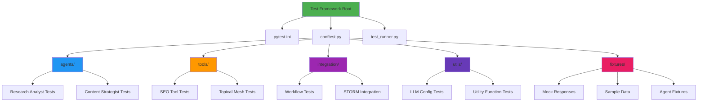

# Test Architecture Visualization

```mermaid
graph TD
    A[Test Framework Root] --> B[pytest.ini]
    A --> C[conftest.py]
    A --> D[test_runner.py]
    
    C --> E[agents/]
    C --> F[tools/]
    C --> G[integration/]
    C --> H[utils/]
    C --> I[fixtures/]
    
    E --> J[Research Analyst Tests]
    E --> K[Content Strategist Tests]
    
    F --> L[SEO Tool Tests]
    F --> M[Topical Mesh Tests]
    
    G --> N[Workflow Tests]
    G --> O[STORM Integration]
    
    H --> P[LLM Config Tests]
    H --> Q[Utility Function Tests]
    
    I --> R[Mock Responses]
    I --> S[Sample Data]
    I --> T[Agent Fixtures]
    
    style A fill:#4CAF50
    style E fill:#2196F3
    style F fill:#FF9800
    style G fill:#9C27B0
    style H fill:#673AB7
    style I fill:#E91E63
```