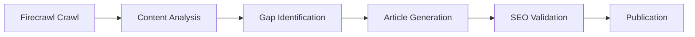

# Article Generator Robot

CrewAI agent specialized in competitor analysis and original content generation using Firecrawl.

## Overview

The Article Generator analyzes competitor websites and generates SEO-optimized original articles to fill content gaps.

## Architecture



## Key Features

### Firecrawl Integration
- **Crawl:** Complete competitor site analysis in clean markdown
- **Extract:** Structured data extraction (titles, content, metadata)
- **Actions:** Dynamic page interaction when needed

### Content Analysis
- Semantic analysis of competitor content
- Topic and keyword extraction
- Content gap identification
- SEO opportunity mapping

### Article Generation
- Original content based on competitive insights
- SEO-optimized structure and keywords
- Internal linking recommendations
- Schema.org metadata generation

## Workflow

1. **Crawl:** Firecrawl extracts competitor site content
2. **Analyze:** CrewAI agent identifies patterns and gaps
3. **Generate:** Create original article filling identified gaps
4. **Validate:** SEO checks and quality validation
5. **Publish:** Output to content pipeline

## Pydantic Schemas

```python
from pydantic import BaseModel, Field
from typing import List, Dict

class ArticleAnalysis(BaseModel):
    competitor_url: str
    key_topics: List[str]
    content_gaps: List[str]
    seo_opportunities: List[str]
    word_count: int
    readability_score: float

class GeneratedArticle(BaseModel):
    title: str = Field(max_length=70)
    meta_description: str = Field(max_length=160)
    content: str
    seo_metadata: Dict[str, str]
    internal_links: List[str]
    schema_markup: Dict

    def word_count(self) -> int:
        return len(self.content.split())
```

## Firecrawl Integration

```python
from firecrawl import FirecrawlApp

firecrawl = FirecrawlApp(api_key=os.getenv('FIRECRAWL_API_KEY'))

# Crawl competitor site
result = firecrawl.crawl_url(
    url="https://competitor.com/blog",
    params={
        'limit': 50,
        'formats': ['markdown']
    }
)

# Extract structured data
extracted = firecrawl.extract(
    url="https://competitor.com/article",
    schema={
        'title': 'string',
        'main_content': 'string',
        'headings': 'array'
    }
)
```

## Performance Metrics

| Metric | Target |
|--------|--------|
| Article relevance | >0.85 score |
| Content uniqueness | >90% |
| Generation time | <15 minutes |
| SEO score | >80/100 |

## SEO Integration

The Article Generator coordinates with the SEO Robot to ensure:
- Topical flow consistency
- Internal linking alignment
- Keyword coverage without cannibalization
- Schema markup standards

## Configuration

Environment variables (via Doppler):
- `FIRECRAWL_API_KEY` - Firecrawl API access
- `OPENROUTER_API_KEY` or `GROQ_API_KEY` - LLM access

## Quality Checks

Before publication, each article is validated for:
- Minimum word count (1500+ for pillar content)
- Keyword density (1-2% primary keyword)
- Readability score (grade level 8-10)
- Internal link count (3-5 minimum)
- Schema markup completeness
- Meta title/description optimization
