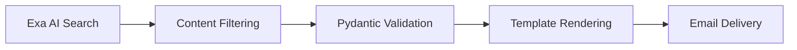

# Newsletter Robot

Automated newsletter generation using PydanticAI with strict validation and Exa AI for content curation.

## Overview

The Newsletter Robot is a single **structured agent** that automates the entire newsletter creation pipeline from content discovery to delivery.

## Architecture



## Key Features

### Content Curation with Exa AI
- **Search API:** Embeddings-based search for weekly news and trends
- **Contents API:** Clean HTML extraction and parsing
- **Quality Filtering:** Relevance scores >0.7 threshold
- **Caching:** 24-hour response caching for cost optimization

### Strict Validation
- Pydantic schemas enforce data structure
- Automatic retry on validation failures
- Consistent output format across issues

### Email Integration
- Responsive HTML templates
- Dynamic content insertion
- EmailIt/Paced Email/Encharge.io delivery

## Workflow

1. **Collect:** Exa AI searches for relevant news and trends
2. **Filter:** Score and rank content by relevance (>0.7)
3. **Structure:** Organize into sections (news, trends, insights)
4. **Validate:** Pydantic schema validation
5. **Generate:** Create subject line and preview
6. **Send:** Automated delivery via email provider

## Pydantic Schemas

```python
from pydantic import BaseModel, Field
from typing import List, Optional
from datetime import datetime

class NewsItem(BaseModel):
    title: str
    summary: str = Field(max_length=200)
    url: str
    relevance_score: float = Field(ge=0.0, le=1.0)
    source: str
    published_date: Optional[datetime]

class NewsletterSection(BaseModel):
    name: str
    items: List[NewsItem]

class Newsletter(BaseModel):
    subject: str = Field(max_length=100)
    preview_text: str = Field(max_length=150)
    sections: List[NewsletterSection]
    generated_at: datetime

    def validate_quality(self) -> bool:
        """Ensure all items meet relevance threshold"""
        for section in self.sections:
            for item in section.items:
                if item.relevance_score < 0.7:
                    return False
        return True
```

## Exa AI Integration

```python
from exa_py import Exa

exa = Exa(api_key=os.getenv('EXA_API_KEY'))

# Search for relevant content
results = exa.search(
    query="AI automation trends",
    num_results=10,
    type="neural",
    use_autoprompt=True
)

# Extract clean content
contents = exa.get_contents(
    ids=[r.id for r in results.results],
    text=True
)

# Filter by relevance
filtered = [
    r for r in results.results
    if r.score > 0.7
]
```

## Quality Metrics

| Metric | Target |
|--------|--------|
| Content relevance | >0.8 average score |
| Validation success | 100% schema compliance |
| Delivery rate | >98% |
| Open rate | >25% |

## Configuration

Environment variables (via Doppler):
- `EXA_API_KEY` - Exa AI API access
- `SENDGRID_API_KEY` - Email delivery
- `EMAIL_FROM` - Sender address

## Reference Implementations

- [exa-crewai](https://github.com/alejandro-ao/exa-crewai) - Exa + CrewAI pipeline
- [AI-Agent-Newsletter-Crew-2.0](https://github.com/sahilbishnoi26/ai-agent-newsletter-crew-2.0) - Streamlit UI + multi-LLM
- [newsletter-ai-agent](https://github.com/ahmadhuss/newsletter-ai-agent) - Researcher/editor/writer agents
