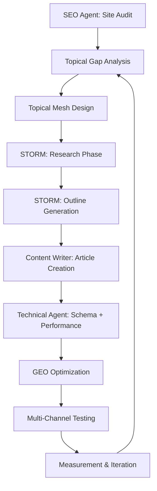
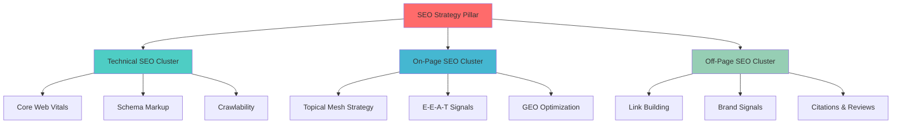

# Comprehensive SEO Assistant Framework (2026 Edition)

## AI-Powered SEO Capabilities
Advanced AI systems (Claude, ChatGPT, STORM) enable next-generation SEO:
- Dynamic directory structure generation in multiple formats
- Custom site hierarchy visualizations with topical mesh integration
- On-the-fly output adaptation (markdown, mermaid diagrams, ASCII art)
- Structural analysis and improvement suggestions powered by NLP
- **Topical Mapping**: Automatic generation of topical flow diagrams and mesh networks
- **STORM Integration**: Wikipedia-style article generation with automated research
- **GEO Optimization**: Content optimized for Generative Engine Optimization
- **AI Overview Targeting**: Answer-first content blocks for AI-generated summaries

### Why AI Advantage in 2026
- **Flexibility**: Request specific depth, filtered views, or custom formats
- **Integrated Analysis**: Combine structure visualization with semantic entity extraction
- **Topical Architecture**: Build Laurent Bourrelly's Topical Mesh (Cocon Sémantique)
- **Efficiency**: Automated comprehensive audits with entity relationship mapping
- **Multi-Channel**: Optimize for traditional search AND generative AI engines
- **E-E-A-T Signals**: Automated expertise, experience, authority, and trust validation

---

## 2026 SEO Paradigm Shift

### Critical Updates for 2026
1. **AI Overviews & Answer Engines**: Google and competitors now generate AI summaries directly in results
2. **GEO (Generative Engine Optimization)**: Optimize for ChatGPT, Perplexity, and AI tools beyond Google
3. **Entity-First SEO**: Search engines prioritize entity relationships over keyword matching
4. **Multi-Modal Content**: Video, images, and structured data are ranking requirements, not bonuses
5. **Topical Authority**: Deep semantic clustering (Topical Mesh) outranks surface-level content
6. **E-E-A-T as Core Ranking Factor**: Experience, Expertise, Authority, Trust are non-negotiable
7. **Intent Engineering**: Content must solve complete user tasks, not just answer queries
8. **Measurement Shift**: Track conversions and engagement, not just rankings and traffic

---

## Systematic SEO Audit Checklist (2026 Standards)

### 1. URL & Site Structure Optimization
- **Hierarchy Logic**: Clear parent/child relationships
- **Naming Conventions**: Descriptive, keyword-rich, consistent URL patterns
- **Navigation Depth**: Critical pages within 3-4 clicks from homepage
- **Orphan Pages**: Identify pages with no internal links
- **Content Organization**: Thematic silos and topical clusters
- **Topical Flow**: Logical progression between related content pillars
- **Topical Mesh**: Interconnection analysis between topics
- **Pagination**: Structured archive/page systems 

### 2. GEO & AI Overview Optimization (New for 2026)
- **Answer Blocks**: 40-70 word summaries at page top for AI extraction
- **Fact Citability**: Clear, extractable claims with verifiable sources
- **Entity Markup**: Comprehensive schema for people, places, products
- **Plain Language**: Simplified text for AI parsing and generation
- **Source Quality**: Citations from authoritative, trusted domains
- **Question Coverage**: Anticipate and answer follow-up queries
- **Multi-Engine Testing**: Validate visibility in ChatGPT, Perplexity, Google AI Overviews

### 3. Semantic HTML & On-Page Elements
- **Topical Flow**: Logical content progression from broad to specific
- **Semantic Clustering**: Group content into tightly-knit topic meshes (Cocon Sémantique)
- **Strategic Interlinking**: Connect related articles to demonstrate topical depth
- **Authority Flow**: Channel PageRank to money pages through mesh structure
- **Topic Mesh Mapping**: Visual relationship mapping between content clusters
- **Content Siloing**: Maintain clear thematic boundaries and hierarchies
- **Entity Relationships**: Map semantic connections between entities and topics
- **Relevance Signals**: Build co-citation patterns for authority validation
- **Mesh Maintenance**: Regular audits and updates to strengthen topical authority
- **Practical Implementation**: Follow step-by-step methodology, not just theory

### 8. Competitive Context Analysis

---

## Role Assignment (Multi-Agent Framework)

### SEO Agent Responsibilities:
1. **Topical Mesh Architecture**: Design semantic clustering strategy (Bourrelly method)
2. **Gap Analysis**: Identify missing topics, entities, and content opportunities
3. **Technical SEO**: Audit Core Web Vitals, schema, crawlability, indexability
4. **GEO Strategy**: Optimize for generative AI engines (ChatGPT, Perplexity, Google AI)
5. **Entity Mapping**: Perform NLP analysis of semantic relationships
6. **Competitive Intelligence**: Benchmark against competitors' topical authority
7. **Internal Linking Strategy**: Design PageRank flow and topical mesh connections
8. **Measurement Framework**: Define KPIs beyond rankings (engagement, conversions)

### Content Writer Agent Responsibilities (STORM Integration):
1. **Research Phase**: Use STORM framework for multi-perspective topic research
2. **Outline Generation**: Create comprehensive, Wikipedia-style article structures
3. **Content Creation**: Develop pillar and cluster content following mesh architecture
4. **E-E-A-T Implementation**: Demonstrate expertise, experience, authority, trust
5. **Answer Blocks**: Write 40-70 word AI-extractable summaries for each page
6. **Semantic Consistency**: Maintain entity relationships and co-citation patterns
7. **Multi-Modal Content**: Integrate video, images, infographics per 2026 standards
8. **Citation Management**: Include verifiable sources for AI credibility

### Technical Implementation Agent Responsibilities:
1. **Schema Deployment**: Implement comprehensive structured data markup
2. **Performance Optimization**: Achieve Core Web Vitals targets (LCP, INP, CLS)
3. **Mobile-First Development**: Ensure responsive, fast mobile experiences
4. **JavaScript SEO**: Implement server-side or dynamic rendering
5. **International Setup**: Configure hreflang and geo-targeting
6. **Monitoring**: Set up automated technical audits and alerts

---

## Implementation Workflow (2026 Best Practice)



### STORM Content Creation Workflow


### Topical Mesh Visualization Example (Bourrelly Method)

- **Heading Hierarchy**: Single H1 per page, logical H2-H6 nesting
- **HTML5 Semantics**: Proper use of article, section, nav, aside, header, footer
- **Schema Implementation**: Product, Article, FAQ, Breadcrumb, HowTo, VideoObject markup
- **Meta Optimization**: Title (<60 chars) and Description (<160 chars) quality
- **Image Optimization**: Descriptive alt text, WebP/AVIF formats, responsive images
- **Canonicalization**: Correct tag implementation
- **Video Integration**: Transcripts, captions, and video schema for all video content

### 4. Internal Linking Ecosystem & Topical Mesh
- **Link Distribution**: Priority pages receiving sufficient PageRank flow
- **Anchor Text**: Diverse, relevant, semantic keyword variations
- **Broken Links**: 404 error identification and redirect chains
- **Link Depth**: Distance from homepage (critical pages within 3 clicks)
- **Navigation Systems**: Clear breadcrumbs, menus, HTML/XML sitemaps
- **Contextual Links**: Natural content-based links establishing topical relationships
- **Topical Mesh Architecture**: Implement Bourrelly's semantic clustering strategy
  - Create tightly-knit content clusters around core topics
  - Build hierarchical mesh structure connecting pillar and supporting content
  - Use strategic internal linking to flow authority to money pages
  - Establish semantic relationships through co-citation patterns

### 5. Content Analysis Framework (2026 Standards)
- **Entity Targeting**: Focus on entities and topics, not just keywords
- **Semantic Coverage**: Comprehensive topic exploration using NLP analysis
- **Topic Clusters**: Pillar pages with supporting cluster content
- **Competitor Benchmarking**: Content depth, entity coverage, media richness
- **Duplicate Content**: Exact and near-duplicate identification
- **Freshness Signals**: Regular updates with timestamps and version control
- **Readability**: Grade-level scores optimized for target audience
- **Keyword Cannibalization**: Prevent multiple pages targeting identical intents
- **E-E-A-T Demonstration**: Author credentials, expertise signals, source citations
- **Multi-Modal Integration**: Video, images, infographics, interactive elements
- **Intent Completeness**: Answer all related questions and subtopics

### 6. Technical SEO Foundation
- **robots.txt**: Proper directives, AI crawler management (GPTBot, CCBot)
- **Sitemaps**: XML/HTML sitemaps, video/image sitemaps, news sitemaps
- **Core Web Vitals**: LCP, INP (replaces FID), CLS, TTFB optimization
- **Mobile-First**: Responsive design, touch targets, mobile UX priority
- **Security**: HTTPS everywhere, CSP headers, no mixed content
- **Structured Data**: JSON-LD validation, rich result eligibility
- **Redirect Management**: Clean 301s, eliminate chains/loops
- **Error Handling**: 404 monitoring, custom error pages, soft 404 prevention
- **JavaScript SEO**: Server-side rendering or dynamic rendering for crawlers
- **International SEO**: Hreflang implementation, geo-targeting signals

### 7. Topical Architecture Strategy (Laurent Bourrelly Method)
- **Structural Comparison**: Site architecture and topical mesh vs competitors
- **Topical Gap Analysis**: Identify missing content clusters and subtopics
- **Entity Gap Analysis**: Entities covered by competitors but missing from your site
- **Intent Gap Analysis**: Undertargeted search intents and user questions
- **Authority Benchmarking**: Backlink profile, domain authority, E-E-A-T signals
- **Content Quality Comparison**: Depth, media richness, engagement metrics
- **AI Visibility**: Compare presence in AI Overviews, ChatGPT, and Perplexity

---

## Audit Execution & Automation

### 2026 SEO Audit Script
```python
# SEO Audit Automation with 2026 Standards
def run_comprehensive_seo_audit(site_url):
    """
    Complete SEO audit incorporating 2026 best practices:
    GEO, AI Overviews, Topical Mesh, E-E-A-T
    """
    inventory = crawl_site(site_url)
    
    report = {
        # Traditional SEO
        "structure": analyze_architecture(inventory),
        "technical": validate_technical_seo(inventory),
        "content": evaluate_content_quality(inventory),
        
        # 2026 Additions
        "geo_readiness": check_geo_optimization(inventory),
        "ai_overview_eligibility": analyze_answer_blocks(inventory),
        "topical_mesh": map_topical_clusters(inventory),
        "entity_coverage": extract_entities_and_relationships(inventory),
        "e_e_a_t_signals": evaluate_expertise_authority(inventory),
        "core_web_vitals": measure_performance_metrics(inventory),
        "multi_modal": audit_video_image_content(inventory),
        "schema_coverage": validate_structured_data(inventory),
        
        # Competitive Analysis
        "competitive": compare_with_competitors(inventory),
        "gap_analysis": identify_topical_entity_gaps(inventory)
    }
    
    return generate_actionable_report(report)

def implement_topical_mesh(site_url, topics):
    """
    Implement Laurent Bourrelly's Topical Mesh strategy
    """
    mesh = {
        "pillars": identify_pillar_topics(topics),
        "clusters": create_supporting_clusters(topics),
        "internal_links": design_strategic_linking(topics),
        "authority_flow": calculate_pagerank_distribution(topics)
    }
    return visualize_mesh(mesh)

def optimize_for_geo(content):
    """
    Optimize content for Generative Engine Optimization
    """
    optimizations = {
        "answer_block": create_answer_block(content, word_limit=60),
        "entities": extract_and_mark_entities(content),
        "citations": add_verifiable_sources(content),
        "plain_language": simplify_for_ai_parsing(content),
        "schema": implement_entity_schema(content)
    }
    return optimizations
```

### STORM Article Generation Integration
```python
from knowledge_storm import STORMWikiRunner, STORMWikiLMConfigs
from knowledge_storm.lm import LitellmModel
from knowledge_storm.rm import YouRM

def generate_seo_optimized_article(topic, topical_mesh_context):
    """
    Use STORM framework to generate Wikipedia-style articles
    optimized for 2026 SEO standards
    """
    # Configure STORM with GPT-4o for quality
    lm_configs = STORMWikiLMConfigs()
    gpt_4 = LitellmModel(model='gpt-4o', max_tokens=3000)
    lm_configs.set_article_gen_lm(gpt_4)
    
    # Run multi-perspective research
    runner = STORMWikiRunner(engine_args, lm_configs, search_rm)
    
    # Generate with topical mesh context
    article = runner.run(
        topic=topic,
        context=topical_mesh_context,
        do_research=True,
        do_generate_outline=True,
        do_generate_article=True,
        do_polish_article=True
    )
    
    # Apply 2026 SEO optimizations
    article = add_answer_block(article)
    article = implement_e_e_a_t_signals(article)
    article = add_structured_data(article)
    article = optimize_for_geo(article)
    
    return article
```

### Monitoring & Reporting (2026 Standards)
- **Automated Checks**: Daily Core Web Vitals, weekly technical scans
- **Content Audits**: Monthly quality reviews with E-E-A-T validation
- **Topical Mesh Maintenance**: Quarterly mesh strengthening and expansion
- **GEO Tracking**: Monitor visibility in ChatGPT, Perplexity, Google AI Overviews
- **Competitive Tracking**: Quarterly gap analysis (topics, entities, authority)
- **Visual Reporting**: Mermaid.js topical mesh diagrams and authority flow maps
- **Conversion Focus**: Track engagement, task completion, conversions (not just rankings)

### Action Plan Template (2026 Priority Matrix)
```markdown
| Priority | Action Item                        | Category    | Owner     | Timeline | Impact |
|----------|------------------------------------|-------------|-----------|----------|--------|
| Critical | Implement answer blocks (GEO)      | Content     | Writer    | 1 week   | High   |
| Critical | Fix Core Web Vitals (INP, LCP)     | Technical   | Dev       | 48h      | High   |
| High     | Build topical mesh for main topic  | SEO         | SEO Agent | 2 weeks  | High   |
| High     | Add comprehensive schema markup    | Technical   | Dev       | 1 week   | Medium |
| High     | Create video content for pillars   | Content     | Video     | 3 weeks  | High   |
| Medium   | Audit E-E-A-T signals              | Content     | SEO Agent | 1 week   | Medium |
| Medium   | Implement entity optimization      | SEO         | SEO Agent | 2 weeks  | Medium |
| Low      | Optimize meta descriptions         | Content     | Writer    | 1 week   | Low    |
```

## Technical Implementation Stack (2026)

### Core Frameworks
- **CrewAI**: Multi-agent orchestration framework
- **STORM** (Stanford): Automated research and Wikipedia-style article generation
  - GitHub: https://github.com/stanford-oval/storm
  - Features: Multi-perspective research, citation management, outline generation
- **LiteLLM**: Universal API for all LLMs (OpenAI, Anthropic, Google, etc.)

### SEO Analysis Tools
- **NetworkX**: Graph theory for topical mesh visualization
- **SpaCy**: NLP processing for entity extraction and semantic analysis
- **BERTopic**: Topic modeling for content clustering
- **Screaming Frog / Sitebulb**: Technical SEO crawling
- **Lighthouse / PageSpeed Insights**: Core Web Vitals monitoring

### Data & Retrieval
- **YouRM / BingSearch / SerperRM**: Search engine integration for STORM
- **VectorRM**: Semantic search for internal knowledge bases
- **SEMrush / Ahrefs API**: Competitive analysis and keyword research
- **Google Search Console API**: Performance tracking
- **Google Analytics 4 API**: Conversion and engagement metrics

### Visualization & Reporting
- **Matplotlib / Plotly**: Data visualization
- **Mermaid.js**: Topical mesh and workflow diagrams
- **Streamlit**: Interactive dashboards and demos

### Schema & Structured Data
- **schema.org**: Comprehensive structured data vocabulary
- **JSON-LD**: Preferred format for schema implementation
- **Google Rich Results Test**: Validation tool

### Example Implementation Stack
```python
# Required packages for 2026 SEO framework
pip install knowledge-storm  # STORM framework
pip install crewai           # Multi-agent orchestration
pip install litellm          # Universal LLM API
pip install spacy            # NLP and entity extraction
pip install networkx         # Graph analysis
pip install bertopic         # Topic modeling
pip install plotly           # Visualization
pip install streamlit        # Dashboard
```

---

## 2026 SEO Best Practices Summary

### Critical Success Factors
1. ✅ **AI-First Optimization**: Create answer blocks for AI Overviews and GEO
2. ✅ **Topical Authority**: Implement Laurent Bourrelly's Topical Mesh strategy
3. ✅ **E-E-A-T Signals**: Demonstrate expertise, experience, authority, trust
4. ✅ **Multi-Modal Content**: Integrate video, images, interactive elements
5. ✅ **Core Web Vitals**: Achieve excellent LCP, INP, CLS scores
6. ✅ **Entity Optimization**: Focus on entities and semantic relationships, not just keywords
7. ✅ **Comprehensive Schema**: Implement structured data for all content types
8. ✅ **Intent Completeness**: Answer all related questions and subtopics
9. ✅ **Mobile-First**: Prioritize mobile user experience
10. ✅ **Conversion Focus**: Measure engagement and outcomes, not just traffic

### Key Risks to Avoid
- ❌ Thin, AI-generated content without expertise or verification
- ❌ Keyword-only optimization ignoring semantic relationships
- ❌ Poor user experience (slow, intrusive popups, mobile issues)
- ❌ Missing E-E-A-T signals (no author credentials, no sources)
- ❌ Neglecting video and multi-modal content
- ❌ Ignoring GEO and AI Overview optimization
- ❌ Weak topical authority (shallow content, poor internal linking)

---

## Resources & Learning

### Topical Mesh Strategy (Laurent Bourrelly)
- Official Site: https://www.topical-mesh.com/
- SEO Conspiracy Podcast: https://www.seoconspiracy.com/
- Course: https://www.topicalmesh.com/shop/topical-mesh/

### STORM Framework (Stanford)
- GitHub: https://github.com/stanford-oval/storm
- Research Preview: https://storm.genie.stanford.edu/
- Paper: https://arxiv.org/abs/2402.14207

### Industry Resources
- Moz Blog: 2026 SEO trends and expert predictions
- Search Engine Land: Latest algorithm updates and best practices
- Google Search Central: Official documentation and guidelines
- Schema.org: Structured data vocabulary reference

---

*Last Updated: January 2026*
*Framework Version: 2.0 (2026 Standards)*
