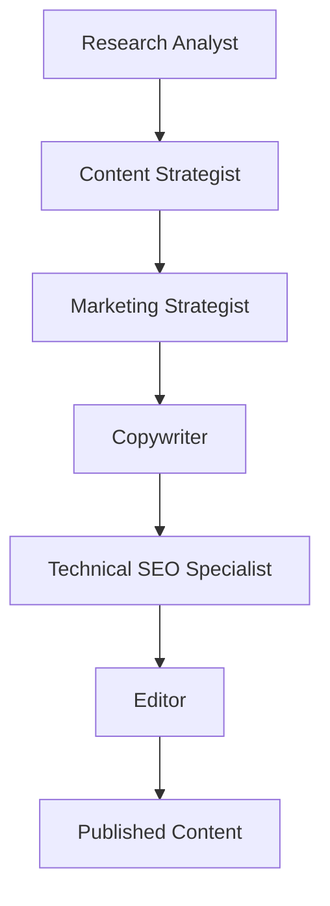

# SEO Robot Agents

The SEO Robot uses a multi-agent CrewAI system with 6 specialized agents working in hierarchical orchestration.

## Agent Overview

| Agent | Role | Tier |
|-------|------|------|
| Research Analyst | Competitive intelligence, SERP analysis | Fast |
| Content Strategist | Architecture, topic clusters, topical mesh | Balanced |
| Marketing Strategist | Business priorities, ROI analysis | Balanced |
| Copywriter | SEO-optimized content creation | Balanced |
| Technical SEO Specialist | Schema, on-page optimization | Fast |
| Editor | Final QA, consistency, formatting | Premium |

## 1. Research Analyst

**Role:** Competitive intelligence and SEO opportunity identification

**Capabilities:**
- SERP analysis and competitor positioning
- Industry trend monitoring and seasonality detection
- Content gap and emerging keyword identification
- Ranking pattern extraction and success factors

**LLM Tier:** Fast (Llama 3 70B) - data analysis focus

## 2. Content Strategist

**Role:** Semantic architecture and content planning

**Capabilities:**
- Pillar page and topic cluster creation
- Detailed, structured outline generation
- Topical flow and internal linking optimization
- Strategic editorial calendar planning
- Laurent Bourrelly's Topical Mesh implementation

**LLM Tier:** Balanced (Claude 3.5 Sonnet) - strategy reasoning

## 3. Marketing Strategist

**Role:** Business orientation and prioritization

**Capabilities:**
- Prioritization matrix aligned with business objectives
- ROI analysis of proposed SEO actions
- Strategic recommendations for competitive markets
- Marketing relevance validation of content

**LLM Tier:** Balanced (Claude 3.5 Sonnet) - business insights

## 4. Copywriter

**Role:** Optimized and engaging content writing

**Capabilities:**
- Natural, SEO-optimized writing
- Strategic keyword insertion without over-optimization
- Attractive, clickable metadata creation
- Tone of voice adaptation for target audience

**LLM Tier:** Balanced (Claude 3.5 Sonnet) - quality content

## 5. Technical SEO Specialist

**Role:** Technical and structural optimization

**Capabilities:**
- Schema.org structured data generation
- Metadata validation and on-page optimization
- Site architecture and internal linking analysis
- Performance and technical factor optimization

**LLM Tier:** Fast (Llama 3 70B) - structured data focus

## 6. Editor

**Role:** Final quality and overall consistency

**Capabilities:**
- Editorial and grammatical quality validation
- Tone of voice and branding consistency control
- Final harmonization before publication
- Markdown formatting and GitHub preparation

**LLM Tier:** Premium (Claude 3 Opus) - final polish

## Workflow



1. Research Analyst analyzes competitive market
2. Content Strategist designs semantic architecture
3. Marketing Strategist defines business priorities
4. Copywriter creates optimized content
5. Technical Specialist validates optimizations
6. Editor harmonizes and finalizes before publication

## Implementation

```python
from crewai import Agent, Crew
from utils.llm_config import LLMConfig

# Create agents with appropriate LLM tiers
research_analyst = Agent(
    role="SEO Research Analyst",
    goal="Conduct competitive intelligence and identify SEO opportunities",
    llm=LLMConfig.get_llm("fast"),
    tools=[analyze_serp_tool, monitor_trends_tool]
)

content_strategist = Agent(
    role="Content Strategist",
    goal="Design semantic architecture and topical mesh",
    llm=LLMConfig.get_llm("balanced"),
    tools=[create_outline_tool, design_mesh_tool]
)

# ... additional agents ...

# Create crew
seo_crew = Crew(
    agents=[research_analyst, content_strategist, ...],
    tasks=[...],
    verbose=True
)
```

## Performance Targets

- **Ranking improvement:** +20% organic visibility within 6 months
- **Traffic increase:** +30% qualified traffic
- **Conversion optimization:** +15% conversion rate
- **Content production:** 50% reduction in production time
