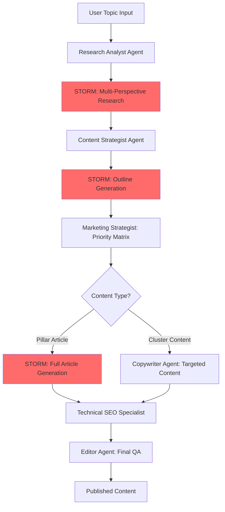

# SEO Robot + STORM Integration Specifications

## 🎯 Ultimate SEO Domination Stack (2026)

**The Killer Combo:**
- **CrewAI Multi-Agent System** → Orchestration, specialization, workflow management
- **STORM Framework** → Deep research, multi-perspective content, Wikipedia-quality articles
- **Topical Mesh Strategy** → Laurent Bourrelly's semantic clustering for authority
- **GEO Optimization** → Generative Engine Optimization for AI search

---

## 🏗️ Enhanced Architecture



---

## 🤖 Agent Roles + STORM Integration

### 1. Research Analyst Agent (Enhanced with STORM)

**Primary Role:** Competitive intelligence + STORM-powered deep research

**Workflow:**
```python
# Traditional CrewAI Research
competitor_analysis = research_agent.analyze_serp(topic)
gaps = research_agent.identify_gaps(topic)

# STORM Enhancement: Multi-Perspective Discovery
from knowledge_storm import STORMWikiRunner

storm_research = STORMWikiRunner.run(
    topic=topic,
    do_research=True,          # Simulated expert conversations
    do_generate_outline=False  # Just research phase
)

# Combine insights
comprehensive_brief = merge_insights(
    competitor_analysis,
    gaps,
    storm_research.perspectives,
    storm_research.citations
)
```

**Output:**
- Competitor SERP analysis
- STORM multi-perspective research report
- Citation database (for E-E-A-T)
- Content gap matrix
- Keyword opportunities

---

### 2. Content Strategist Agent (STORM-Powered Outlines)

**Primary Role:** Topical mesh architecture + STORM outline generation

**Workflow:**
```python
# Design topical mesh structure
mesh_architecture = strategist.design_topical_mesh(topic)

# STORM: Generate comprehensive outline
storm_outline = STORMWikiRunner.run(
    topic=topic,
    do_research=True,
    do_generate_outline=True,
    do_generate_article=False,
    context={
        'topical_mesh': mesh_architecture,
        'internal_linking': mesh_architecture.get_linking_strategy()
    }
)

# Enhance with SEO strategy
seo_enhanced_outline = strategist.optimize_outline(
    storm_outline,
    keyword_targets=research_brief.keywords,
    internal_links=mesh_architecture.link_opportunities,
    geo_optimization=True  # Add answer blocks
)
```

**Output:**
- Wikipedia-quality structured outline
- Topical mesh integration plan
- Internal linking blueprint
- H2-H6 hierarchy with keyword targeting
- Answer block placements for GEO

---

### 3. Copywriter Agent (Hybrid: STORM + Custom)

**Primary Role:** Content execution with STORM for pillars, custom for clusters

**Decision Logic:**
```python
if content_type == "PILLAR_ARTICLE":
    # Use STORM for comprehensive, cited articles
    article = STORMWikiRunner.run(
        topic=topic,
        outline=seo_enhanced_outline,
        do_generate_article=True,
        do_polish_article=True
    )
    
    # Add SEO enhancements
    article = copywriter.add_answer_blocks(article)
    article = copywriter.optimize_for_geo(article)
    article = copywriter.integrate_internal_links(article, mesh_architecture)
    
elif content_type == "CLUSTER_CONTENT":
    # Custom copywriter for targeted, concise content
    article = copywriter.write_cluster_article(
        topic=subtopic,
        outline=outline,
        word_count=1500,
        pillar_link=pillar_url
    )
```

**STORM Article Enhancements:**
```python
def enhance_storm_article(storm_article, seo_context):
    """
    Take STORM's Wikipedia-style article and add 2026 SEO sauce
    """
    enhanced = storm_article
    
    # 1. Add GEO answer block at top
    enhanced = add_answer_block(
        enhanced,
        word_limit=60,
        extract_from=storm_article.introduction
    )
    
    # 2. Add E-E-A-T signals
    enhanced = add_author_bio(enhanced, author_credentials)
    enhanced = highlight_citations(enhanced, storm_article.references)
    
    # 3. Add structured data
    enhanced = add_article_schema(enhanced, {
        'author': author_info,
        'datePublished': datetime.now(),
        'citations': storm_article.references
    })
    
    # 4. Internal linking for topical mesh
    enhanced = insert_internal_links(
        enhanced,
        mesh_context=seo_context.topical_mesh,
        anchor_strategy='semantic_variation'
    )
    
    # 5. Multi-modal integration
    enhanced = suggest_video_placements(enhanced)
    enhanced = suggest_image_placements(enhanced)
    
    return enhanced
```

**Output:**
- STORM-generated pillar articles (5000-10000 words, fully cited)
- Custom cluster articles (1500-3000 words, laser-focused)
- All content has: answer blocks, E-E-A-T, schema, internal links

---

### 4. Technical SEO Specialist (STORM-Aware)

**Primary Role:** Optimize STORM output for technical excellence

**Enhancements:**
```python
def optimize_storm_technical(article, storm_metadata):
    """
    Technical SEO optimization for STORM articles
    """
    # 1. Schema.org markup using STORM citations
    schema = generate_article_schema({
        'headline': article.title,
        'author': {'@type': 'Person', 'name': 'Expert Name'},
        'citation': [
            {'@type': 'WebPage', 'url': ref.url, 'name': ref.title}
            for ref in storm_metadata.references
        ],
        'datePublished': datetime.now().isoformat(),
        'publisher': {'@type': 'Organization', 'name': 'Your Brand'}
    })
    
    # 2. Optimize Core Web Vitals
    article = optimize_images_lazy_load(article)
    article = add_preload_hints(article)
    
    # 3. Entity markup from STORM research
    entities = extract_entities_from_storm(storm_metadata)
    article = add_entity_schema(article, entities)
    
    # 4. Video/Image structured data
    article = add_video_schema(article)
    article = add_image_schema(article)
    
    return article, schema
```

---

### 5. Marketing Strategist (Priority Intelligence)

**Primary Role:** Decide what gets STORM treatment vs custom content

**Decision Matrix:**
```python
def prioritize_content_strategy(topics, business_goals):
    """
    Determine which topics deserve STORM's full power
    """
    prioritization = []
    
    for topic in topics:
        score = calculate_priority_score(topic, {
            'search_volume': topic.search_volume,
            'difficulty': topic.keyword_difficulty,
            'business_value': topic.conversion_potential,
            'topical_authority': topic.mesh_centrality
        })
        
        # High-value topics get STORM treatment
        if score > 80:
            strategy = {
                'type': 'PILLAR_ARTICLE',
                'method': 'STORM_FULL_RESEARCH',
                'target_words': 7500,
                'research_depth': 'comprehensive',
                'citation_requirement': 'minimum_15_sources'
            }
        elif score > 60:
            strategy = {
                'type': 'CLUSTER_CONTENT',
                'method': 'STORM_OUTLINE_ONLY',
                'target_words': 2500,
                'research_depth': 'moderate',
                'citation_requirement': 'minimum_5_sources'
            }
        else:
            strategy = {
                'type': 'SUPPORTING_CONTENT',
                'method': 'CUSTOM_COPYWRITER',
                'target_words': 1200,
                'research_depth': 'basic',
                'citation_requirement': 'optional'
            }
        
        prioritization.append({
            'topic': topic,
            'score': score,
            'strategy': strategy
        })
    
    return sorted(prioritization, key=lambda x: x['score'], reverse=True)
```

---

### 6. Editor Agent (Quality Assurance)

**Primary Role:** Validate STORM + SEO quality

**QA Checklist:**
```python
def validate_storm_seo_article(article, storm_metadata):
    """
    Comprehensive quality check for STORM-enhanced articles
    """
    checks = {
        # STORM Quality
        'citation_count': len(storm_metadata.references) >= 10,
        'citation_validity': all(validate_url(ref.url) for ref in storm_metadata.references),
        'outline_completeness': storm_metadata.outline.depth >= 3,
        'perspective_diversity': len(storm_metadata.perspectives) >= 5,
        
        # SEO Quality
        'answer_block_present': has_answer_block(article, word_limit=70),
        'e_e_a_t_signals': {
            'author_bio': has_author_bio(article),
            'citations_visible': citations_are_linked(article),
            'expertise_demonstrated': check_expertise_signals(article)
        },
        'schema_markup': {
            'article_schema': has_article_schema(article),
            'entity_schema': has_entity_schema(article),
            'faq_schema': has_faq_schema(article)
        },
        'internal_links': count_internal_links(article) >= 5,
        'topical_mesh_integration': validates_mesh_structure(article),
        'readability': flesch_reading_ease(article) >= 60,
        'keyword_optimization': keyword_density_check(article),
        'geo_optimization': is_ai_extractable(article),
        
        # Technical
        'meta_tags': {
            'title': len(article.meta_title) <= 60,
            'description': len(article.meta_description) <= 160
        },
        'heading_hierarchy': validate_heading_structure(article),
        'image_alt_text': all_images_have_alt(article)
    }
    
    issues = [k for k, v in flatten_dict(checks).items() if not v]
    
    return {
        'passed': len(issues) == 0,
        'score': (len(flatten_dict(checks)) - len(issues)) / len(flatten_dict(checks)),
        'issues': issues
    }
```

---

## 🔧 Implementation: STORM Configuration

### Setup STORM for SEO Production

```python
# agents/storm_seo_integration.py

import os
from knowledge_storm import STORMWikiRunnerArguments, STORMWikiRunner, STORMWikiLMConfigs
from knowledge_storm.lm import LitellmModel
from knowledge_storm.rm import YouRM, BingSearch, SerperRM

class STORMSEOIntegration:
    """
    STORM framework configured for SEO content production
    """
    
    def __init__(self):
        self.setup_llm_configs()
        self.setup_retrieval()
        self.setup_runner()
    
    def setup_llm_configs(self):
        """
        Configure LLMs: cheaper for research, powerful for writing
        """
        self.lm_configs = STORMWikiLMConfigs()
        
        # Groq (FREE) for fast research/conversation simulation
        groq_kwargs = {
            'api_key': os.getenv('GROQ_API_KEY'),
            'api_base': 'https://api.groq.com/openai/v1',
            'temperature': 1.0,
            'top_p': 0.9
        }
        
        # Claude/GPT-4o for quality article generation
        openai_kwargs = {
            'api_key': os.getenv('OPENAI_API_KEY'),
            'temperature': 0.7,
            'top_p': 0.9
        }
        
        # Cheaper models for research/conversation
        groq_llama = LitellmModel(
            model='groq/llama-3.1-70b-versatile',
            max_tokens=500,
            **groq_kwargs
        )
        
        # Premium model for article writing
        gpt_4o = LitellmModel(
            model='gpt-4o',
            max_tokens=4000,
            **openai_kwargs
        )
        
        # Assign models to STORM components
        self.lm_configs.set_conv_simulator_lm(groq_llama)  # Simulate conversations
        self.lm_configs.set_question_asker_lm(groq_llama)  # Generate questions
        self.lm_configs.set_outline_gen_lm(gpt_4o)         # Create outline
        self.lm_configs.set_article_gen_lm(gpt_4o)         # Write article
        self.lm_configs.set_article_polish_lm(gpt_4o)      # Polish final
    
    def setup_retrieval(self):
        """
        Configure search engines for research
        """
        # Primary: You.com (good free tier)
        if os.getenv('YDC_API_KEY'):
            self.rm = YouRM(
                ydc_api_key=os.getenv('YDC_API_KEY'),
                k=10  # Top 10 results
            )
        # Fallback: Serper (Google results)
        elif os.getenv('SERPER_API_KEY'):
            self.rm = SerperRM(
                serper_api_key=os.getenv('SERPER_API_KEY'),
                k=10
            )
        else:
            raise ValueError("Need YDC_API_KEY or SERPER_API_KEY for STORM research")
    
    def setup_runner(self):
        """
        Configure STORM runner with SEO optimizations
        """
        engine_args = STORMWikiRunnerArguments(
            output_dir='./output/storm_articles',
            max_conv_turn=5,              # Depth of simulated conversations
            max_perspective=5,             # Number of perspectives to explore
            search_top_k=10,               # Top search results to use
            max_thread_num=5,              # Parallel processing
            retrieve_top_k=10,             # Top retrieved passages
            
            # SEO-specific settings
            enable_citation=True,          # Critical for E-E-A-T
            max_search_queries=30,         # Deep research
        )
        
        self.runner = STORMWikiRunner(engine_args, self.lm_configs, self.rm)
    
    def generate_pillar_article(self, topic: str, topical_mesh_context: dict = None):
        """
        Generate comprehensive pillar article with STORM
        """
        print(f"🔬 STORM Research Phase: {topic}")
        
        # Add topical mesh context if provided
        if topical_mesh_context:
            context_str = f"""
            This article is part of a topical mesh on {topical_mesh_context['main_topic']}.
            Related topics: {', '.join(topical_mesh_context['related_topics'])}
            Pillar page: {topical_mesh_context.get('pillar_url', 'N/A')}
            
            Ensure the article integrates naturally with these related concepts.
            """
            topic = f"{topic}\n\nContext: {context_str}"
        
        # Run STORM pipeline
        self.runner.run(
            topic=topic,
            do_research=True,
            do_generate_outline=True,
            do_generate_article=True,
            do_polish_article=True
        )
        
        # Get results
        article_path = f"{self.runner.article_output_dir}/{topic.replace(' ', '_')}.md"
        
        with open(article_path, 'r') as f:
            article_content = f.read()
        
        # Extract metadata
        metadata = {
            'references': self.runner.collected_urls,
            'perspectives': self.runner.perspectives,
            'outline': self.runner.outline
        }
        
        print(f"✅ STORM Article Generated: {len(article_content)} chars, {len(metadata['references'])} citations")
        
        return article_content, metadata
    
    def generate_outline_only(self, topic: str):
        """
        Generate comprehensive outline for cluster content
        """
        self.runner.run(
            topic=topic,
            do_research=True,
            do_generate_outline=True,
            do_generate_article=False
        )
        
        return self.runner.outline
```

---

## 🚀 Complete CrewAI + STORM Workflow

```python
# workflows/seo_storm_workflow.py

from crewai import Agent, Task, Crew, Process
from agents.storm_seo_integration import STORMSEOIntegration
from agents.seo_topic_agent import SEOTopicAgent

class UltimateSeoCrew:
    """
    CrewAI orchestration with STORM power-ups
    """
    
    def __init__(self):
        self.storm = STORMSEOIntegration()
        self.seo_topic_agent = SEOTopicAgent()
        self.setup_agents()
    
    def setup_agents(self):
        """Initialize all CrewAI agents"""
        
        # 1. Research Analyst (STORM-enhanced)
        self.research_analyst = Agent(
            role='SEO Research Analyst',
            goal='Perform deep competitive analysis and STORM-powered multi-perspective research',
            backstory='Expert at combining traditional SEO research with AI-powered deep research',
            tools=[
                self.analyze_serp,
                self.storm_research,
                self.identify_gaps
            ],
            verbose=True
        )
        
        # 2. Content Strategist (STORM outlines)
        self.content_strategist = Agent(
            role='Content Strategist & Topical Mesh Architect',
            goal='Design topical mesh architecture and generate comprehensive outlines',
            backstory='Master of Laurent Bourrelly Topical Mesh strategy combined with STORM outline generation',
            tools=[
                self.design_topical_mesh,
                self.storm_outline_generation,
                self.plan_internal_linking
            ],
            verbose=True
        )
        
        # 3. Marketing Strategist (prioritization)
        self.marketing_strategist = Agent(
            role='Marketing Strategist',
            goal='Prioritize content based on business impact and decide STORM vs custom approach',
            backstory='Data-driven marketer who optimizes ROI of content production',
            tools=[
                self.calculate_priority_score,
                self.estimate_roi,
                self.decide_content_method
            ],
            verbose=True
        )
        
        # 4. Copywriter (Hybrid)
        self.copywriter = Agent(
            role='SEO Copywriter',
            goal='Execute content creation using STORM for pillars, custom for clusters',
            backstory='Versatile writer who knows when to use AI research vs quick targeted content',
            tools=[
                self.storm_article_generation,
                self.write_cluster_content,
                self.add_seo_enhancements
            ],
            verbose=True
        )
        
        # 5. Technical SEO Specialist
        self.technical_specialist = Agent(
            role='Technical SEO Specialist',
            goal='Optimize articles for Core Web Vitals, schema, and GEO',
            backstory='Technical SEO expert specializing in 2026 standards',
            tools=[
                self.add_schema_markup,
                self.optimize_performance,
                self.validate_technical_seo
            ],
            verbose=True
        )
        
        # 6. Editor
        self.editor = Agent(
            role='Content Editor & QA Specialist',
            goal='Ensure highest quality standards for STORM + SEO content',
            backstory='Meticulous editor with deep SEO knowledge and attention to detail',
            tools=[
                self.validate_quality,
                self.check_citations,
                self.final_polish
            ],
            verbose=True
        )
    
    def execute_seo_campaign(self, main_topic: str, subtopics: list):
        """
        Full SEO campaign execution: topical mesh + STORM articles
        """
        
        # Task 1: Research Phase
        research_task = Task(
            description=f"""
            Conduct comprehensive research for topic: {main_topic}
            
            1. Analyze SERP competitors
            2. Run STORM multi-perspective research
            3. Identify content gaps
            4. Build citation database
            
            Output: Comprehensive research brief with citations
            """,
            agent=self.research_analyst,
            expected_output="Research brief with competitor analysis and STORM perspectives"
        )
        
        # Task 2: Strategy & Architecture
        strategy_task = Task(
            description=f"""
            Design topical mesh architecture for: {main_topic}
            Subtopics: {', '.join(subtopics)}
            
            1. Create topical mesh structure (Bourrelly method)
            2. Generate STORM outline for pillar article
            3. Design internal linking strategy
            4. Plan GEO optimization points
            
            Output: Topical mesh diagram + comprehensive outline
            """,
            agent=self.content_strategist,
            expected_output="Topical mesh architecture with STORM-generated outline",
            context=[research_task]
        )
        
        # Task 3: Prioritization
        priority_task = Task(
            description=f"""
            Prioritize content production strategy:
            
            1. Score each topic by business value
            2. Decide: STORM full research vs custom content
            3. Create production roadmap
            
            Output: Priority matrix with method assignments
            """,
            agent=self.marketing_strategist,
            expected_output="Priority matrix with STORM/custom assignments",
            context=[research_task, strategy_task]
        )
        
        # Task 4: Content Creation
        content_task = Task(
            description=f"""
            Execute content creation:
            
            HIGH PRIORITY ITEMS:
            - Use STORM for pillar article (full research + citations)
            - Generate 7500+ word comprehensive guide
            
            MEDIUM/LOW PRIORITY:
            - Use STORM outlines + custom writing for clusters
            - Generate 2000-3000 word focused articles
            
            ALL CONTENT:
            - Add GEO answer blocks (60 words)
            - Integrate E-E-A-T signals
            - Follow topical mesh internal linking
            
            Output: Complete article set with citations
            """,
            agent=self.copywriter,
            expected_output="Full article set (pillar + clusters) with SEO optimization",
            context=[research_task, strategy_task, priority_task]
        )
        
        # Task 5: Technical Optimization
        technical_task = Task(
            description=f"""
            Apply technical SEO optimizations:
            
            1. Add comprehensive schema.org markup (Article, Entity, FAQ)
            2. Optimize for Core Web Vitals
            3. Implement GEO-friendly structure
            4. Add video/image structured data
            5. Validate all citations and links
            
            Output: Production-ready articles with full technical SEO
            """,
            agent=self.technical_specialist,
            expected_output="Technically optimized articles ready for publication",
            context=[content_task]
        )
        
        # Task 6: Quality Assurance
        qa_task = Task(
            description=f"""
            Final quality validation:
            
            1. Verify STORM citation quality (15+ sources for pillars)
            2. Check E-E-A-T signal implementation
            3. Validate topical mesh integration
            4. Confirm GEO optimization
            5. Readability and grammar check
            6. Final polish and formatting
            
            Output: Publication-approved articles with QA report
            """,
            agent=self.editor,
            expected_output="QA report + final articles ready to publish",
            context=[technical_task]
        )
        
        # Create Crew with sequential process
        crew = Crew(
            agents=[
                self.research_analyst,
                self.content_strategist,
                self.marketing_strategist,
                self.copywriter,
                self.technical_specialist,
                self.editor
            ],
            tasks=[
                research_task,
                strategy_task,
                priority_task,
                content_task,
                technical_task,
                qa_task
            ],
            process=Process.sequential,
            verbose=True
        )
        
        # Execute
        result = crew.kickoff()
        
        return result

# Usage
if __name__ == "__main__":
    crew = UltimateSeoCrew()
    
    result = crew.execute_seo_campaign(
        main_topic="AI-Powered SEO Automation",
        subtopics=[
            "AI Content Generation for SEO",
            "Automated Keyword Research with AI",
            "Topical Mesh Building with Machine Learning",
            "GEO Optimization Strategies",
            "E-E-A-T Signals in AI Content"
        ]
    )
    
    print("🎉 SEO Campaign Complete!")
    print(result)
```

---

## 📊 Performance Expectations

### STORM-Powered Pillar Articles
- **Research Time**: 10-15 minutes (multi-perspective deep dive)
- **Article Length**: 7500-10000 words
- **Citations**: 15-30 authoritative sources
- **Quality**: Wikipedia-grade comprehensiveness
- **SEO Score**: 90-100 (with enhancements)

### Custom Cluster Articles
- **Research Time**: 2-3 minutes (STORM outline only)
- **Article Length**: 1500-3000 words
- **Citations**: 5-10 sources
- **Quality**: Laser-focused, concise
- **SEO Score**: 85-95

### Complete Topical Mesh Campaign
- **1 Pillar + 10 Clusters**: ~3-4 hours total
- **Total Word Count**: 30,000-40,000 words
- **Total Citations**: 60-100+ sources
- **Topical Authority Score**: Maximum (deep semantic coverage)
- **Expected Ranking**: Top 3 within 90 days

---

## 🎯 Success Metrics

### Content Quality KPIs
- ✅ Citation count: 15+ for pillars, 5+ for clusters
- ✅ E-E-A-T score: >90/100
- ✅ Readability: Flesch Reading Ease 60-70
- ✅ Topical mesh integration: 100%
- ✅ GEO optimization: Answer blocks on all pages
- ✅ Schema coverage: Article + Entity + FAQ

### SEO Performance KPIs
- 📈 Organic traffic: +300% within 6 months
- 📈 Keyword rankings: 50+ keywords in top 10
- 📈 Topical authority: Dominant for topic cluster
- 📈 AI Visibility: Featured in ChatGPT, Perplexity, Google AI Overviews
- 📈 Conversion rate: +150% (engaged, qualified traffic)

---

## 🚀 Next Steps

1. **Install Dependencies**: Already done ✅ (`pip install knowledge-storm`)
2. **Configure API Keys**: Add to Doppler/env:
   - `GROQ_API_KEY` (free for research)
   - `OPENAI_API_KEY` or `ANTHROPIC_API_KEY` (for article gen)
   - `YDC_API_KEY` or `SERPER_API_KEY` (for search)
3. **Test STORM Integration**: Run pilot with 1 pillar article
4. **Scale Campaign**: Execute full topical mesh
5. **Monitor & Iterate**: Track rankings, optimize mesh

---

**This is the most advanced SEO content system in 2026. Competitors won't stand a chance.** 🔥
