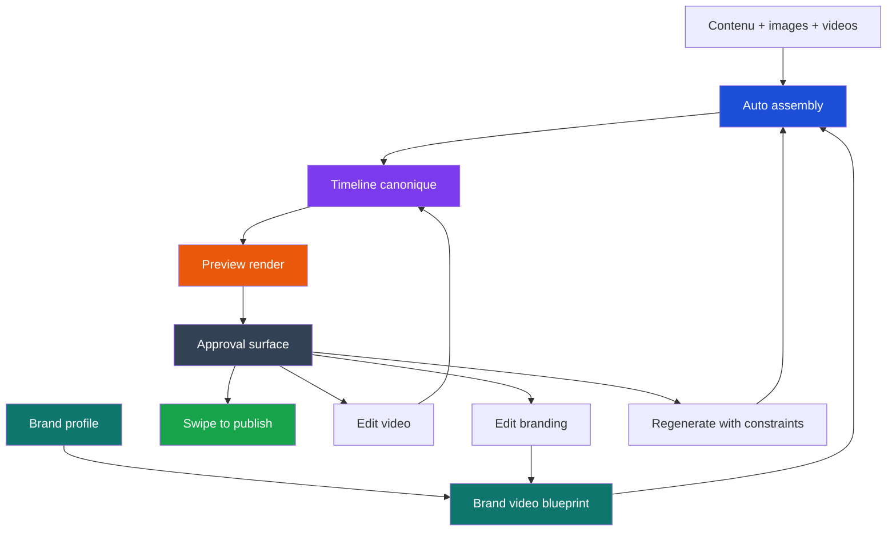

# ContentGlowz : des vidéos déjà prêtes à publier, pas des heures de montage

La plupart des outils vidéo te donnent une timeline vide.

Ensuite, ils te laissent faire le travail le plus long :

- placer les scènes ;
- choisir les plans ;
- régler les textes ;
- ajuster les transitions ;
- exporter ;
- recommencer si le résultat ne colle pas à ta marque.

Ce n'est pas la promesse de ContentGlowz.

Notre objectif est plus simple et plus utile :

- tu donnes un contenu, des images, des vidéos et un branding ;
- ContentGlowz assemble automatiquement un draft vidéo cohérent ;
- tu le prévisualises ;
- tu le publies rapidement ;
- tu n'édites que si tu en as vraiment envie.

Autrement dit, le montage manuel ne doit pas être la porte d'entrée normale du produit. Il doit devenir une option.

> Cette architecture décrit la direction produit canonique que nous sommes en train de structurer. Certaines briques existent déjà dans la plateforme, d'autres sont en cours de cadrage et d'intégration.

## Ce que ça change vraiment

Dans un workflow classique, l'utilisateur fait d'abord le travail de montage, puis vérifie le rendu à la fin.

Dans ContentGlowz, on veut inverser cet ordre :

1. la plateforme assemble un draft ;
2. l'utilisateur voit une preview ;
3. il publie vite ;
4. il n'ouvre l'éditeur que si quelque chose mérite d'être retouché.

Le gain recherché n'est pas seulement du confort. C'est aussi :

- plus de vitesse de production ;
- plus de cohérence de marque ;
- moins de friction entre idée, draft et publication ;
- moins de dépendance à des compétences de montage ;
- une meilleure capacité à publier souvent.

## Le problème des outils editor-first

Beaucoup d'outils vidéo partent de cette logique :

1. ouvre un éditeur ;
2. crée une timeline vide ;
3. ajoute tes médias ;
4. ajuste les transitions, le texte, les animations ;
5. exporte.

Le problème est simple : ce flux suppose que l'utilisateur veut devenir monteur ou au moins coordinateur de montage.

Ce n'est pas notre hypothèse.

Notre hypothèse est que la majorité des utilisateurs veulent surtout :

- des contenus déjà fabriqués ;
- une cohérence de marque ;
- une validation rapide ;
- une publication fluide ;
- une possibilité de corriger si nécessaire.

## Le modèle ContentGlowz en une phrase

Voici le flux que nous voulons rendre évident dans l'app :

```text
contenu + assets + branding
        ->
generation automatique d'un draft video
        ->
preview
        ->
swipe to publish
        ->
publication

si besoin :
- edit video
- edit branding
- regenerate with constraints
```

L'idée clé est la suivante : **la vidéo prête à publier est générée avant l'édition manuelle**.

Tu ne pars pas d'une page vide. Tu pars d'un draft déjà structuré.

## Le schéma complet

```text
1. Brand profile
   ->
   definit les couleurs, typos, logo, captions, CTA, rythme, transitions

2. Brand video blueprint
   ->
   transforme ce branding en systeme video reusable

3. Source inputs
   ->
   contenu + images + videos + references + format cible

4. Auto assembly
   ->
   cree une vraie timeline ContentGlowz

5. Preview render
   ->
   rend un MP4 de preview pour cette version exacte

6. Approval surface
   ->
   swipe to publish
   ou
   edit video
   ou
   edit branding
   ou
   regenerate

7. Publish
   ->
   publication uniquement si la preview courante est valide
```

Ce point est crucial : le draft généré n'est pas un objet magique caché à côté de l'éditeur. C'est une **vraie version de la timeline canonique**.

## Le schéma visuel



Si tu veux la lire autrement :

- le branding ne rend rien directement ;
- il alimente un blueprint ;
- ce blueprint guide la génération automatique ;
- la génération remplit la timeline canonique ;
- la preview et la publication partent toujours de cette timeline.

## Pourquoi ce modèle est plus solide qu'un simple générateur

Un bon produit vidéo IA ne doit pas juste "sortir une vidéo".

Il doit aussi :

- rester cohérent avec la marque ;
- rester modifiable ;
- rester compréhensible ;
- rester publiable sans ambiguïté.

C'est exactement pour ça que nous séparons les rôles.

## Pourquoi le branding ne doit pas être un moteur de rendu séparé

C'est un point d'architecture important.

On pourrait imaginer un "branding editor" qui produise lui-même une vidéo finale. En pratique, ce serait une erreur.

Pourquoi ?

Parce qu'on se retrouverait avec deux vérités concurrentes :

- une vidéo calculée par les règles de branding ;
- une vidéo calculée par la timeline.

Et dès qu'un utilisateur modifierait quelque chose, tout deviendrait confus :

- quelle preview est la bonne ?
- quelle version peut être publiée ?
- que se passe-t-il si on change le branding après un edit manuel ?
- comment régénérer sans écraser des scènes corrigées à la main ?

La bonne séparation est beaucoup plus simple :

- le **branding editor** définit des règles ;
- l'**auto-assembly** applique ces règles ;
- la **timeline** reste l'unique source de vérité éditable ;
- le **renderer** rend cette timeline ;
- le **publish flow** publie uniquement une preview validée de cette timeline.

## Le branding editor : changer le système, pas une vidéo isolée

Le branding editor n'est pas un mini studio vidéo.

Son rôle est de contrôler le système qui produit les drafts :

- les typos ;
- les couleurs ;
- le traitement du logo ;
- le style des captions ;
- les lower thirds ;
- les transitions ;
- l'intensité de motion ;
- les intros/outros ;
- les CTA ;
- les archétypes de vidéos par canal.

Par exemple, un même branding peut définir des comportements différents pour :

- un `ugc_ad` ;
- un `product_demo` ;
- un `faceless_reel` ;
- un `talking_head_highlight` ;
- un `testimonial_cut` ;
- un `recap`.

Donc, quand tu modifies le branding editor, tu ne "montes" pas une vidéo. Tu modifies le système qui pilotera les prochains drafts, et qui pourra aussi régénérer le draft courant.

## Le video editor : corriger vite, sans repartir de zéro

Le video editor reste important, mais son rôle change.

Il sert à faire des ajustements ciblés sur une vidéo déjà fabriquée :

- changer l'ordre de scènes ;
- remplacer un asset ;
- ajuster un texte ;
- corriger des captions ;
- retailler un clip ;
- verrouiller une partie avant régénération.

Autrement dit, le video editor devient un endroit de **correction et de finition**, pas un atelier où tout commence à zéro.

## Swipe to publish : publier vite, sans perdre les garde-fous

`Swipe to publish` ne veut pas dire "publier n'importe quoi en aveugle".

Cela veut dire :

1. un draft a déjà été assemblé ;
2. une preview a déjà été rendue ;
3. les contraintes de publication ont déjà été vérifiées ;
4. l'utilisateur n'a plus besoin de cliquer partout pour terminer le flux.

Le swipe devient alors un geste simple de validation finale, pas une séquence pénible de boutons, de menus et de confirmations techniques.

En interne, ce geste reste strictement encadré :

- la preview doit correspondre à la version courante ;
- le compte de publication doit être autorisé ;
- le format doit être valide pour la destination ;
- les changements de dernière minute doivent invalider la preview précédente.

Donc `swipe to publish` est un raccourci d'expérience utilisateur, pas une suppression des garde-fous.

## Et si tu veux reprendre la main ?

Il y a trois cas principaux.

### 1. Il veut corriger une seule vidéo

Il ouvre le video editor.

Exemples :

- remplacer un plan ;
- déplacer un hook ;
- raccourcir une intro ;
- modifier un texte à l'écran.

### 2. Il veut changer la logique de marque

Il ouvre le branding editor.

Exemples :

- captions trop agressifs ;
- CTA trop visible ;
- transitions trop rapides ;
- palette trop saturée ;
- style plus premium ou plus direct.

### 3. Il veut une nouvelle version automatique

Il demande une régénération.

Mais cette régénération peut respecter des contraintes explicites :

- garder certains assets ;
- conserver certaines scènes ;
- ne pas toucher au CTA ;
- garder le timing des captions ;
- exclure certains styles ou couleurs.

C'est une partie essentielle du système : **régénérer ne doit pas vouloir dire tout casser**.

## Pourquoi cette architecture est meilleure pour un vrai produit

Elle évite trois erreurs fréquentes.

### 1. Le faux "full autopilot"

Promettre une automatisation parfaite est généralement une mauvaise idée.

Nous préférons un système qui :

- produit automatiquement ;
- reste explicable ;
- reste modifiable ;
- reste gouverné.

### 2. Le studio vidéo trop libre

Un studio trop libre est puissant, mais il déplace le travail vers l'utilisateur.

Pour beaucoup d'équipes, c'est exactement ce qu'il faut éviter.

### 3. Les modèles concurrents

Si le branding, la génération et l'édition vivent dans trois formats de données séparés, le produit devient vite incompréhensible.

Nous voulons un seul centre de gravité : la timeline canonique.

## Résumé en une phrase

Le branding editor définit les règles, l'IA génère un draft, la timeline garde la vérité, le renderer montre la preview, et l'utilisateur publie vite ou ajuste seulement si nécessaire.

## En pratique, quelle expérience on vise ?

L'expérience cible ressemble à ça :

- tu choisis un contenu ;
- tu ajoutes ou relies tes assets ;
- tu appliques ton branding ;
- ContentGlowz génère un draft vidéo cohérent ;
- tu le regardes ;
- tu swipes pour publier ;
- tu ne rentres dans l'édition détaillée que si un vrai ajustement est utile.

Plus la plateforme est bonne, moins le montage devient un travail.

Le but n'est pas de retirer le contrôle. Le but est de retirer la friction.

## FAQ rapide

### Est-ce que ContentGlowz remplace totalement le montage ?

Le but est que le montage manuel ne soit plus le chemin normal. La plateforme doit produire un draft déjà exploitable. L'édition reste disponible pour les cas où elle apporte une vraie valeur.

### Est-ce que je peux quand même modifier la vidéo ?

Oui. Tu peux corriger la vidéo dans l'éditeur de timeline, ou modifier la logique globale dans le branding editor si le problème vient du système de marque plutôt que d'un draft précis.

### Pourquoi ne pas publier automatiquement sans preview ?

Parce qu'un système de publication fiable a besoin d'une version visible, vérifiable et liée à une vraie timeline. Le `swipe to publish` simplifie la fin du flux, mais ne supprime pas la vérité produit ni les garde-fous.

### Si je change le branding, est-ce que mes vidéos changent toutes d'un coup ?

Pas silencieusement. Un changement de branding doit produire une nouvelle révision de règles, puis proposer une régénération contrôlée. Sinon, tu perds toute lisibilité sur ce qui a été publié et pourquoi.

### Quelle est la différence entre "edit video" et "edit branding" ?

`Edit video` corrige une vidéo particulière. `Edit branding` change les règles qui influenceront les prochains drafts et les futures régénérations.

## Ce que ça change pour nos utilisateurs

Concrètement, cela veut dire que ContentGlowz doit tendre vers ce type d'expérience :

- tu ajoutes ton contenu et tes assets ;
- tu choisis ton branding ;
- tu reçois une vidéo déjà montée ;
- tu la regardes ;
- tu swipes pour publier ;
- tu n'ouvres l'éditeur que si quelque chose mérite vraiment d'être touché.

C'est cette logique que nous voulons rendre de plus en plus visible dans l'app : plus de drafts prêts à publier, moins de temps perdu à assembler manuellement.
